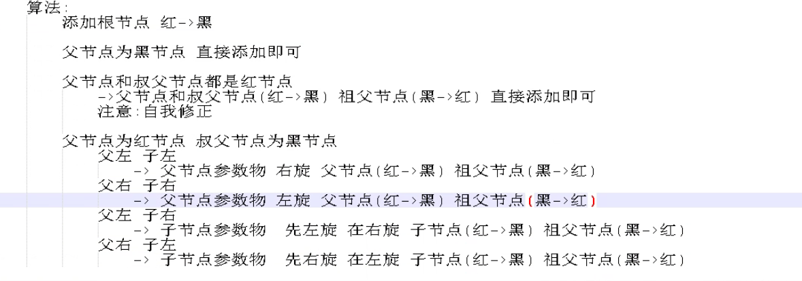

## 树结构
### 应用场景
> 数据结构：数据存储和管理的一个模型。
> 提高资源利用率
### 基本概念
> 衡量算法的优劣，时间复杂度和空间复杂度
### 树结构
1. 二叉树，可能会变成线性表
2. 平衡树，平衡的代价过于巨大。每次修改树结构都要判断。速度最快
3. 红黑树
   1. 规范
      1. 红黑树的节点非红即黑
      2. 根节点一定是黑节点
      3. 叶子节点也为黑
      4. 最终节点的叶子节点为黑节点
      5. 添加结点默认初始为红节点
      6. 红节点的子节点不能为红节点，黑节点的子节点没有要求
      7. 从根节点到每个最终节点的路线中，黑节点的总量一致
   2. 算法
      1. 如果添加节点为根节点。``直接变黑``。
      2. 如果父节点为黑节点。``直接添加红节点``。
      3. 如果父节点为红节点，叔叔节点为红节点。``父亲和叔叔变黑，祖父变红，直接添加``。
      4. 父红，叔黑，父为祖左，我为右，父左旋。然后按照5走
      5. 父红，叔黑，父为祖左，我为左，祖右旋，祖变红，父变黑

      - 左旋转：把左子树，变成父亲。把原本左子树的右子树，变成自己的左子树。（自己就变成了原本左子树的右子树）
      - 右旋转：把右子树，变成父亲。把原本右子树的左子树，变成自己的右子树。
  
   3. 分析
   
---
4. B树
> 保证排序原则，在节点中可以存储有序队列，可以降低树的深度。
> 使得添加和删除不会特别麻烦。时间复杂度介于线性表和二叉树
> 红黑树想获得全部数据，很麻烦。

5. B+树
> 在B树的基础上，在底层添加了双向链表 增加了数据冗余，双向链表保留整个已排序的所有数据。

> 在范围查找中先通过二分查找定位临界点树节点，数据节点根据指针关联到双向链表中的数据，而后在通过对链表直接遍历获取数据结果，由于是双向链表因此方向自由选择