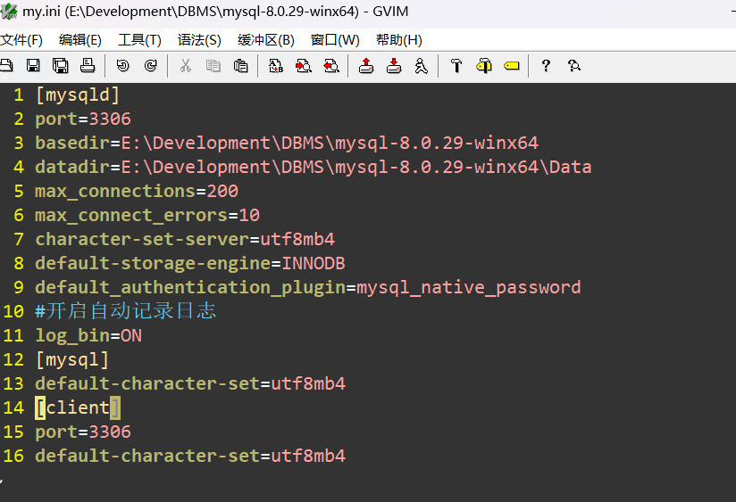
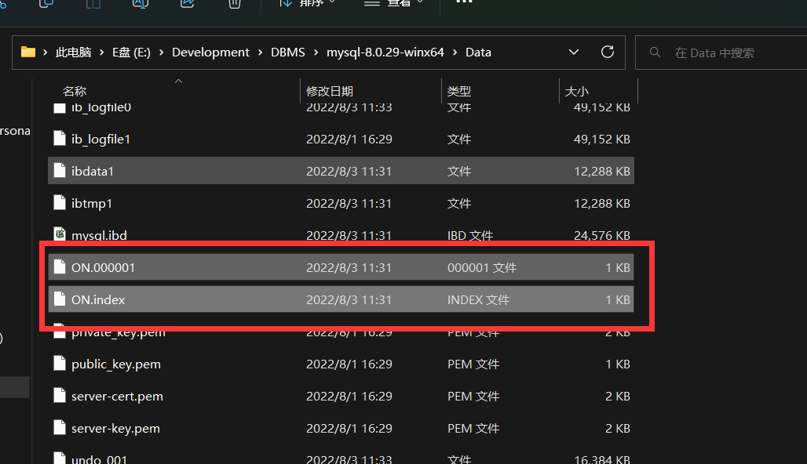

## 数据备份 2022-08-03
### 原理
>日志记录了全部的操作, 在恢复的时候直接从头开始到尾重新执行脚本
---
### 操作
1. 手动备份
   >这个所谓的手动备份是把sql脚本导出，恢复其实是导入sql脚步重新执行
   1. 备份 `mysqldump -u root -proot 需要备份的数据库名称 > E:/20220803log.sql`
   2. 恢复 `mysql -u root -p < E:/20220803log.sql` 会自动创建好自动数据库
2. 自动备份(实时备份)
   >先修改my.ini的配置文件，在[mysqld]中加入 log_bin=自动备份的文件名

   
   
   >恢复数据的时候不会继续记录

   >每次重启就会产生一个新的日志文件
   
   >自动备份，你都做自动备份了，那肯定直接从数据库的建立之前就开启
   1. 查看日志记录
      `mysqlbinlog --no-defaults "E:\Development\DBMS\mysql-8.0.29-winx64\Data\datelog.000001"`
   2. 恢复日志记录
      `mysqlbinlog --no-defaults --start-datetime="2022-08-03 15:39:09" --stop-datetime="2022-08-03 15:39:50" "E:\Development\DBMS\mysql-8.0.29-winx64\Data\datelog.000003" | mysql -u root -p`
      >例子说明：我从15:39:09秒创建好了数据库，在15:39:54秒删除了表中的全部数据，在此期间我插入了4条数据。假设15:19:54秒是误操作，那么我要的就是，从15:39:09秒创建表成功后，把到15:39:50秒的所有执行的sql操作都执行一次，那么这次误差除的操作就可以看作不存在了
   
---
### 技巧
```sql
   #复制一张表，保留结构和数据，不会保留原表的约束，也就没有主键外键
   create table tableName_bf as select * from tableName;

   #复制一张表，只保留结构，不保留数据，也不会保留约束
   create table tableName_bf as select * from tableName where 1<0;

   #当原表坏了的时候就可以通过清表然后批量添加数据完成恢复，能截断先截断
   insert into tableName select * from tableName_bf;        
```