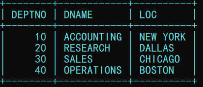
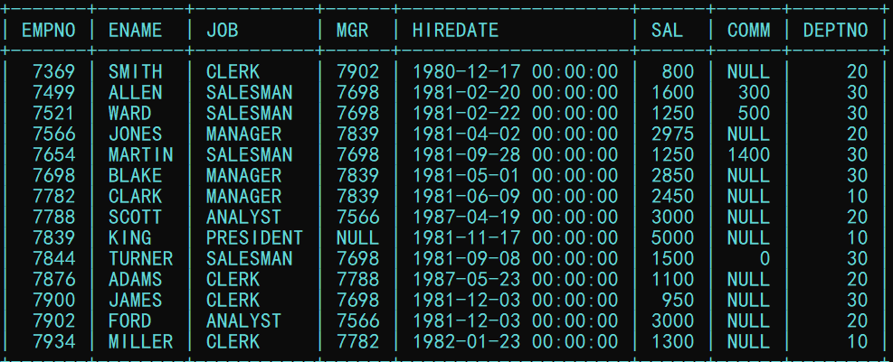
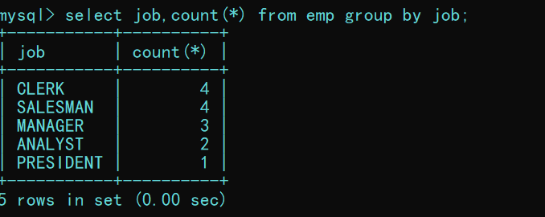
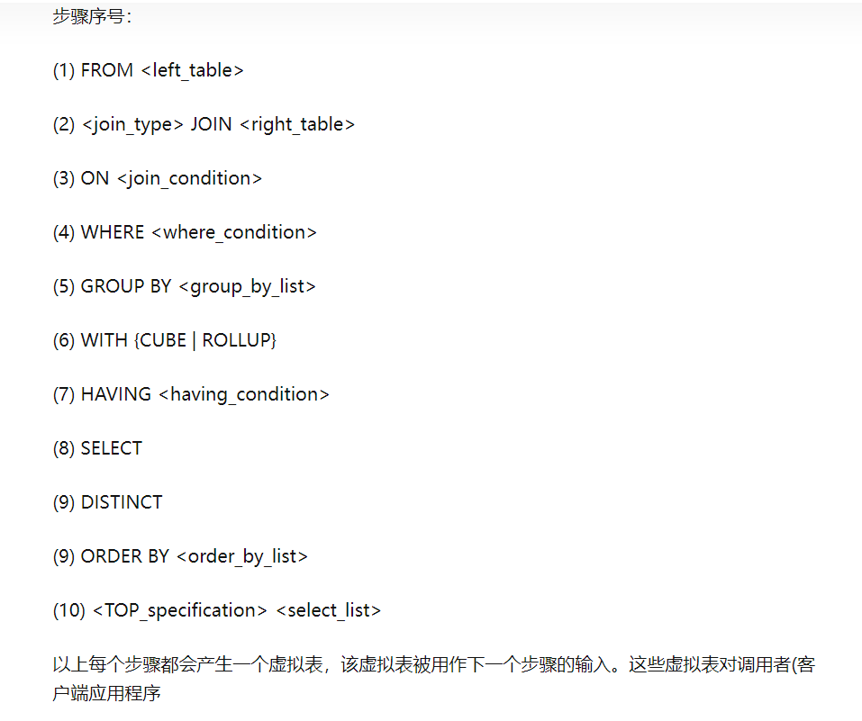
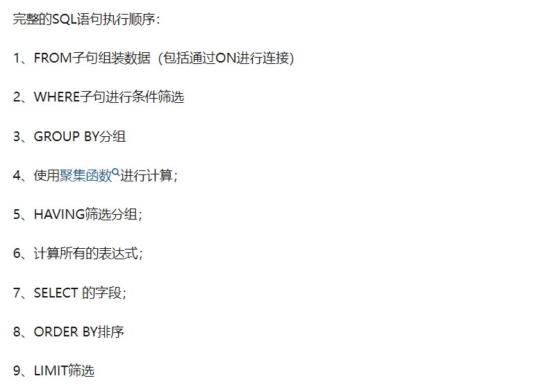

## 数据查询业务实现
### 环境准备
   1. dept部门表结构说明
      1. deptno 部门编号           *主键*
      2. dname  部门名称
      3. loc    部门所在地
   

   1. emp员工表
      1. empno      工号           *主键*
      2. ename      姓名
      3. mgr        直接上司工号
      4. hiredate   入职时间
      5. sal        底薪
      6. comm       奖金
      7. depino     所在部门编号    *外键*

---
### 关键字
```sql
    select 
        列名
        distinct    #去重
        as          #别名
        sun(), count(), avg(), max(), min(),    #聚集函数
    from
        表名
        where       #筛选
        group by    #分组
        having      #筛选
        order by    #排序
        limit       #分页（mysql特有）

```
---
### 筛选
```sql
    #范围内取值 底薪从 1500 到 3000 建议使用第二种
    select * from emp where sal >= 1500 and sal < 3000;
    select * from emp where sal between 1500 and 3000;

    #null运算结果为null, 这样能把null的影响去除
    select * from emp where sal + ifnull(comm,0) >= 1500;

    #别名不能直接作为当前条件筛选的列
    select sal+ifnull(comm,0) as income from emp where income;  #这是错误的，废话
    select sal+ifnull(comm,0) as income from emp where sal+ifnull(comm,0);


    #别名可以直接作为当前排序的列
    select sal+ifnull(comm,0) as income from emp order by income desc;

    #单列多查询
    select * from emp where job = 'SALESMAN' or  job = 'CLERK'
    select * from emp where job in ('SALESMAN','CLERK')
```
### 排序
```sql
    #默认升序，NULL最小, 字符串也能排序
    select * from emp order by comm asc
    select * from emp order by comm desc
    
    #多个排序
    select * from order by deptno ASC, sal desc;
```
---
### 分页
```sql
    #起始行，截取的行数，下标从0开始。这里表示从下标为10开始，拿5行（含10）
    select * from emp limit 10, 5
```
### 模糊查询
>通配符%任意长度，_匹配单个长度字符
```sql
    #表示名字中不包含a的员工信息
    select * from emp where ename not like '%A%'
```
---
### 分组聚合
>生活中的分组是分类

>数据库中的分组是构建统计的条件，目的是为了统计，作为统计的前提。如果只分组不统计，数据库中只做分组这个分组操作没有作用。


```sql
    #分组后的列显示的应该是被分组的列，不然没有任何意义，这样的操作等同与去重
    select job from emp group by job;

    #分组后显示得列可以加入聚合函数列。比如现在这样就是统计
    select job, count(*) from emp group by job;

    #统计每个部门中的每个职业的人数（分组条件多个）先按部门分组，再按职位分组
    select deptno, job, count(job) from emp group by deptno, job;

    #对分组聚合后的结果进行筛选， 使用having
    select job, count(job) from emp group by job having count(job) > 2 ;
```
---
### 联表查询
>内联接 等价于 简化联接，仅仅是写法不同，只展示关联的数据信息

>外连接时有主次之分，主表信息必须展示，如果没有关联信息使用NULL

```sql
    #使用简化连接显示每个员工的部门名称
    select emp.ename,dept.dname from dept,emp where emp.deptno = dept.deptno;

    #使用外联接，主表中的字段必须显示
    #右联接，主表为dept
    select dname, ename from emp right join dept on emp.deptno = dept.deptno;

    #自联接
    select e1.ename as 'bossName',e2.ename from emp as e1 right join emp as e2 on e2.mgr = e1.empno;
```
>只要涉及联表查询 一律使用外联接 分清主次关系后 就能保证主表的数据完整性
---
### 子查询
>每次子查询的返回结果在select时只能为一行一列

>
```sql
    #使用子查询完成行列转换
    select 
    name as '姓名', 
    fenshu as '语文', 
    (select fenshu from tbtest02 as t2 where t2.kecheng='数学' and t2.name=t1.name ) as '数学',
    (select fenshu from tbtest02 as t3 where t3.kecheng='英语' and t3.name=t1.name) as '英语', 
    (select sum(fenshu) from tbtest02 where name=t1.name) as '总分' 
    from tbtest02 as t1 where kecheng='语文';
```
### 三目运算表达式
>sql中在聚合函数是可以放表达式的

>sum( if( kecheng='语文', fenshu, 0) ) 统计成绩，只加上语文的其他为0，就能达成行列转换的效果


---
### 联合查询
>联合的前提，表结构要一致
```sql
    #查找部门编号为 10，20 分而治之 
    select * from emp where deptno = 10
    union
    select * from emp where deptno = 20;

    #等同的效果
    select * from emp where deptno in (10,20);

    #不去重联合
    select * from emp where deptno = 10
    union all
    select * from emp where deptno = 10

```
---

### 特定查询
>行列转换和数据排名
```sql
    #声明变量, 和初始化
    @a := 1

    #赋值
    @a := @a + 1

    #为数据排名
    select empno,
    ename, 
    sal, 
    @a:=@a+1 as '排名' 
    from emp, (select @a:=0) t1 
    order by sal desc;
    +-------+--------+------+--------+
    | empno | ename  | sal  | 排名   |
    +-------+--------+------+--------+
    |  7839 | KING   | 5000 |      1 |
    |  7788 | SCOTT  | 3000 |      2 |
    |  7902 | FORD   | 3000 |      3 |
    |  7566 | JONES  | 2975 |      4 |
    |  7698 | BLAKE  | 2850 |      5 |
    |  7782 | CLARK  | 2450 |      6 |
    |  7499 | ALLEN  | 1600 |      7 |
    |  7844 | TURNER | 1500 |      8 |
    |  7934 | MILLER | 1300 |      9 |
    |  7521 | WARD   | 1250 |     10 |
    |  7654 | MARTIN | 1250 |     11 |
    |  7876 | ADAMS  | 1100 |     12 |
    |  7900 | JAMES  |  950 |     13 |
    |  7369 | SMITH  |  800 |     14 |
    +-------+--------+------+--------+

    #可重复排名（步长法）
    select 
    empno, 
    ename,
    if(@b=sal,@a,@a:=@a+@c) as '排名',
    if(@b=sal,@c:=@c+1,@c:=1) as '步长',
    @b:=sal as sal 
    from emp, (select @a:=0) t1, (select @b:=0) t2,(select @c:=1) t3 
    order by sal desc;

    +-------+--------+--------+--------+------+
    | empno | ename  | 排名   | 步长   | sal  |
    +-------+--------+--------+--------+------+
    |  7839 | KING   |      1 |      1 | 5000 |
    |  7788 | SCOTT  |      2 |      1 | 3000 |
    |  7902 | FORD   |      2 |      2 | 3000 |
    |  7566 | JONES  |      4 |      1 | 2975 |
    |  7698 | BLAKE  |      5 |      1 | 2850 |
    |  7782 | CLARK  |      6 |      1 | 2450 |
    |  7499 | ALLEN  |      7 |      1 | 1600 |
    |  7844 | TURNER |      8 |      1 | 1500 |
    |  7934 | MILLER |      9 |      1 | 1300 |
    |  7521 | WARD   |     10 |      1 | 1250 |
    |  7654 | MARTIN |     10 |      2 | 1250 |
    |  7876 | ADAMS  |     12 |      1 | 1100 |
    |  7900 | JAMES  |     13 |      1 |  950 |
    |  7369 | SMITH  |     14 |      1 |  800 |
    +-------+--------+--------+--------+------+

```
如果你有排名需求就打开链接
[mysql排名函数](https://blog.csdn.net/m0_69435474/article/details/124174041)
---
### sql语句的执行顺序
[知乎原回答](https://zhuanlan.zhihu.com/p/377795994)


>sql在执行的时候执行的结果（临时表）可能会产生新列，新列的名称等于操作名称
